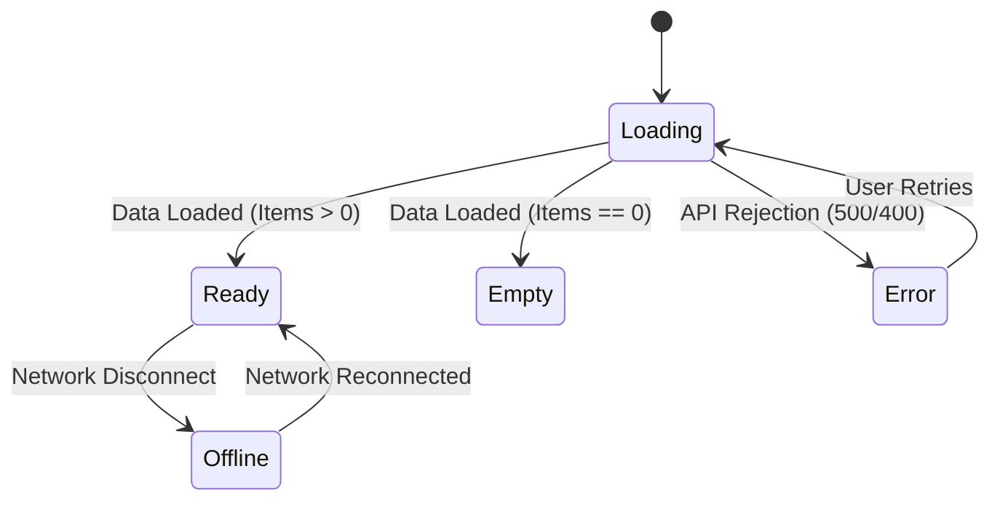

# UI State Machine & Resilience Verifier

## Purpose & Scope
This skill provides a rigorous verification protocol ensuring that every page and interactive component explicitly handles all 5 canonical UI states: **Idle/Ready**, **Loading/Pending**, **Empty/No-Data**, **Error/Failed**, and **Offline/Disconnected**.

## 🔄 The 5 Canonical UI States

### 1. Loading State
- Use skeleton loaders matching the exact geometry of the content cards instead of generic circular spinners.

### 2. Empty State
- Never leave a blank container when lists are empty.
- Render `<StatusState />` or custom empty state card with:
  - An expressive icon (e.g. `BookOpen`).
  - Clear explanation of why the view is empty.
  - Actionable CTA button (e.g. "Explore Academy Catalog").

### 3. Error State
- Catch errors using `error.tsx` or inline error boundaries with a "Try Again" recovery action.

### 4. Offline State
- When browser loses internet connection, show non-intrusive banner or dedicated `<DisconnectionFreezeOverlay />` for active exams.
